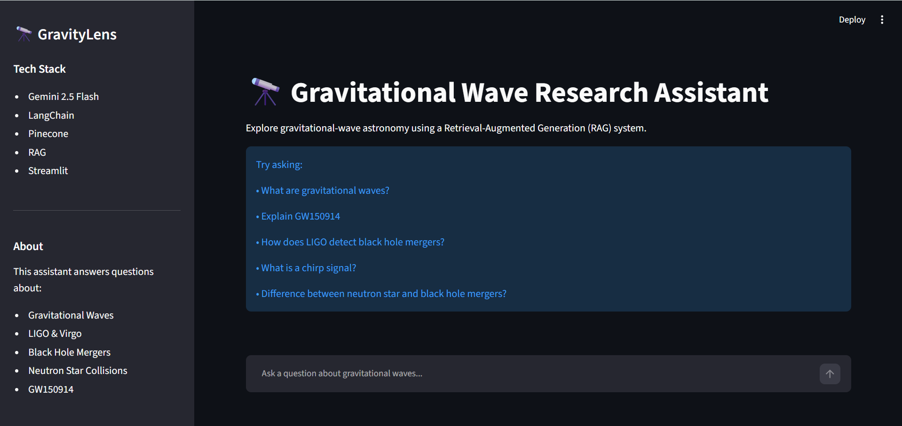
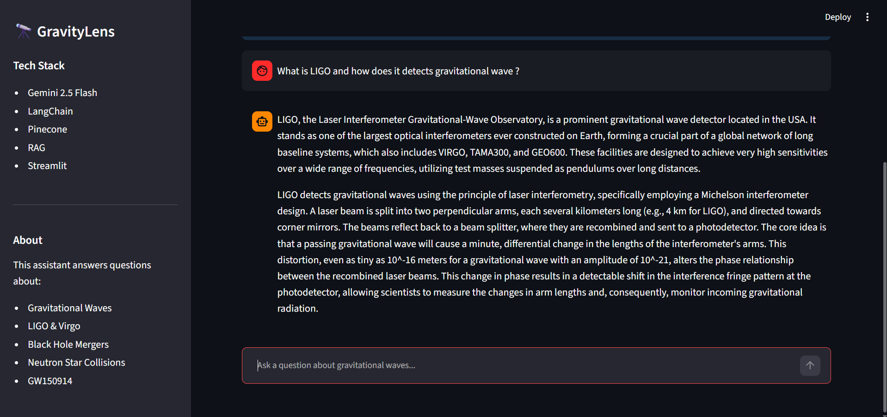
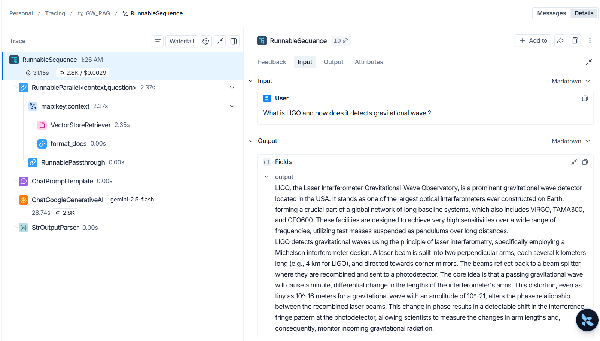

# 🔭 GravityLens - Gravitational Wave Research Assistant

GravityLens is a Retrieval-Augmented Generation (RAG) application that enables users to explore gravitational wave astronomy through natural language conversations. The system retrieves relevant information from scientific research documents and generates context-grounded responses using Large Language Models (LLMs).

This project combines my passion for space science with modern AI engineering techniques such as semantic search, vector databases, and Retrieval-Augmented Generation.

---

## 🚀 Features

- Conversational interface for asking questions about gravitational waves
- Retrieval-Augmented Generation (RAG) pipeline
- Semantic search using vector embeddings
- Context-grounded responses to reduce hallucinations
- Interactive Streamlit-based user interface
- Powered by Gemini and Pinecone

---

## 🏗️ System Architecture

```text
Scientific PDFs
       │
       ▼
Document Loading
       │
       ▼
Text Chunking
       │
       ▼
Gemini Embeddings
       │
       ▼
Pinecone Vector Database
       │
       ▼
Retriever
       │
       ▼
Prompt Construction
       │
       ▼
Gemini LLM
       │
       ▼
Generated Answer
       │
       ▼
Streamlit Interface
```

---

## 🛠️ Tech Stack

### AI & LLM

- LangChain
- Gemini 2.5 Flash
- Google Generative AI Embeddings

### Vector Database

- Pinecone

### Frontend

- Streamlit

### Programming Language

- Python

---

## 📚 Knowledge Base

The assistant is built on scientific documents related to:

- Gravitational Waves
- LIGO Observations
- Black Hole Mergers
- Neutron Star Collisions
- Gravitational Wave Detection
- Astrophysical Discoveries

---

## ⚙️ How It Works

1. Research documents are loaded and processed.
2. Documents are split into manageable chunks.
3. Gemini embeddings are generated for each chunk.
4. Embeddings are stored in Pinecone.
5. User queries are converted into embeddings.
6. Pinecone retrieves the most relevant document chunks.
7. Retrieved context is provided to Gemini.
8. Gemini generates a context-aware response.

---

## 📂 Project Structure

```text
GravityLens/
│
├── app.py
├── rag_chain.py
├── ingest.py
├── requirements.txt
├── README.md
│
├── data/
│
├── screenshots/
│
└── .gitignore
```

---

## 🔧 Installation

### Clone the Repository

```bash
git clone https://github.com/Akshat17400560/GravityLens.git
cd GravityLens
```

### Install Dependencies

```bash
pip install -r requirements.txt
```

### Configure Environment Variables

Create a `.env` file:

```env
GOOGLE_API_KEY=your_google_api_key
PINECONE_API_KEY=your_pinecone_api_key
INDEX_NAME=gravitational-wave-rag
```

### Ingest Documents

```bash
python ingest.py
```

### Run the Application

```bash
streamlit run app.py
```

---

## 💡 Example Questions

- What are gravitational waves?
- Explain GW150914.
- How does LIGO detect gravitational waves?
- What causes black hole mergers?
- What is the significance of gravitational wave astronomy?
- How are neutron star collisions different from black hole collisions?

---

## 📸 Screenshots

### Home Page



### Example Conversation



### Generated Response



---

## 🎯 Key Concepts Demonstrated

- Retrieval-Augmented Generation (RAG)
- Semantic Search
- Embeddings
- Vector Databases
- Prompt Engineering
- LangChain Expression Language (LCEL)
- Context Grounding
- LLM Application Development

---

## 🔮 Future Improvements

- Conversational Memory
- Source Citation Display
- Multi-document Knowledge Bases
- Agentic Workflows using LangGraph
- Hybrid Search (Keyword + Semantic Search)
- Research Paper Summarization

---

## 👨‍💻 Author

**Akshat Verma**

AI Engineer | Computer Science Graduate

Passionate about AI, Space Science, LLM Applications, and Intelligent Systems.

---

## ⭐ Acknowledgements

- LangChain
- Pinecone
- Google Gemini
- Streamlit
- LIGO Scientific Collaboration
